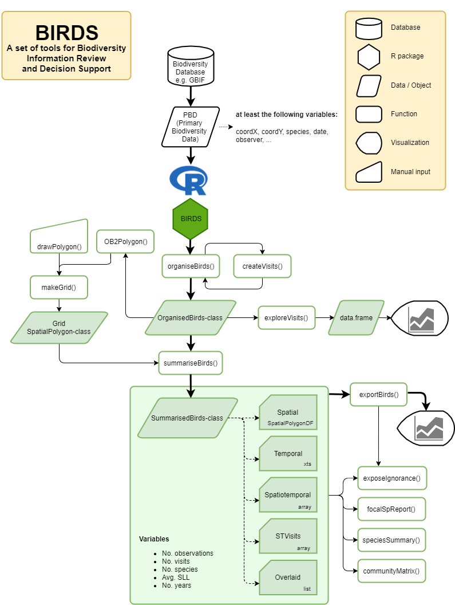
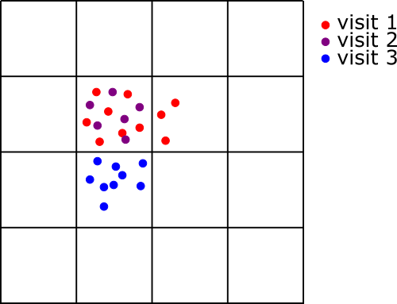

```{r setup, include = FALSE}
knitr::opts_chunk$set(
  collapse = TRUE,
  comment = "#>"
)
```

The use of the package is very simple but requires knowledge of a few concepts and making decisions regarding a few assumptions, that we will cover shortly. The use of is package starts off with a data table with one species observation per row (primary biodiversity data, PBD). As you may already know the minimum fields each observation must have to be a legitimate species observation are:

1. geographical coordinates  
2. a date  
3. a species identification  
4. and hopefully the name of the observer/s (this requirement varies for different biodiversity databases)  

Apart from this, biodiversity databases require a plethora of variables and metadata, often following the [DarwinCore](https://dwc.tdwg.org/) standard. This package recognizes as a default the column names of DarwinCore, but other names can be specified too. 

Before using the BIRDS package we already have to make some first decisions which data to retrieve and how, and whether to clean the data, as shown in this workflow . 
The user can download the primary biodiversity data from their database of choice, import it into R. Data can be cleaned when considered necessary. As mentioned in the package description, the tools provided by the `BIRDS` package **do not** correct or improve the accuracy of the data.


>**Reference species group**  
>Because visits result from the sampling process they can only be defined for a reference species group, i.e. a group of species observed and recorded by similar methods. The rationale for a reference species group is based on the assumption that species groups share similar bias: we assume that, despite varying field skills and accuracy, observers reporting observations for species of a reference species group share similar observer behavior and methods and, hence, generate data with similar sampling bias (Phillips et al. 2009). From this we can assume that the larger the number of visits (or observations) reporting species from the reference group at a specific unit of space and time, the more likely it is that the lack of visits for (or observations of) a particular species reflects the absence of (or failure to detect) a focal species rather than a lack of visits and reports made.  
>It is important to keep in mind that, to keep the sampling bias consistent, the reference species group should only include species that are assumed to be sampled with the same methodology (Ponder et al. 2001). For example, a reference group should not include all species in the Order Lepidoptera because butterflies *sensu stricto* (superfamily Papilionoidea) are sampled in very different ways than most other species of Lepidoptera (mainly moths).


#### Organizing the data
Once the data is in R as a `data.frame` and loaded the package BIRDS, the fun begins. The function `organiseBirds()` converts the `data.frame` into a `SpatialPointsDataFrame` using the specified coordinates. The function takes as default coordinates in geodesic WGS84 (epsg:4326), but other can be used too. It also adds to each observation a unique identifier for the assumed *visit* (sampling event) it belongs to, given some input parameters. There are a few options here depending on the variables included in the data set, but the default is the unique combination of "locality", "day", "month", "year", and "recordedBy". Alternatives could be a known "eventID", or using the "rightsHolder" instead of the recorder, if that matches the reality and better helps to identify unique visits. The overall idea is to separate unique sample units, i.e. a transect, a square, a combination of point samples, or a random walk along the river side. If you lack a clear spatial definition of a visit, there are a few things you can do in the next steps (visit exploration and summary).  

The `organiseBirds()` function will also help to keep those observation that are useful to you based on the level of taxonomical resolution or taxon rank (the level to which each species was identified). Sometimes, observers can only identify the species up to genus, but these observations are not always helping our analyses. Then, you can define which "taxonRank" should be kept specifying the column that should be read and the ranks to be kept. As default everything with species identifications or lower are kept (varietals and subspecies). At the same time, you may not want to differentiate among subspecies, because you know, accuracy can get shaky. Then, you can opt to simplify the names by removing all epithets and author names.

The result is a `SpatialPointsDataFrame` wrapped into an object of class `OrganizedBirds`, with additional information. To save memory, only a few columns that will be used later are kept. The `OrganizedBirds` has as an attribute the variable "visitCol" that stores which is the column with the default ID for the visits in case the are many (see below).

```{r, eval=FALSE}
?organiseBirds()
OB <- organizeBirds(bombusObs, simplifySppName = TRUE)
OB <- organizeBirds(bombusObs, sppCol = "species", simplifySppName = FALSE, 
                     taxonRankCol = "taxonRank", taxonRank = c("SPECIES", "SUBSPECIES","VARIETY"))
```


>**Field visit**  
>A central concept used by the `BIRDS` package is the “visit” – defining the sampling
unit as a sampling event by a unique observer (or group of observers), at a unique
unit of space and time (commonly a day). Visits can help us to summarize the amount
of effort expended in the field. During a visit, the observer commonly samples 
(i.e. observes and records) species by similar methods. The sampling effort can 
vary among visits, with the amount of effort expended being greater when spending
more time, and reporting more of the observed species. The same number of observations 
(records of species) at a unique unit of time and space could be made by either 
few observers reporting many species (greater effort by each observer) or many 
observers reporting few species (small effort by each observer). Using visits as
sampling units allows separation of sampling effort into the effort that can be 
expressed through the number of visits by different observers and the effort per
visit (e.g. species list length, or when available the time spent during a visit). 
Hence, the quality (completeness) of the data can be judged by using information 
for each visit and information from a collection of visits. 

#### First exploration  
Once you have organised your data, we highly recommend to explore the data to see if the definition of the visits that you applied matches your expectations. The `exploreVisits()` function will summarize some statistics for each visit and return a `data.frame` with the following columns:  
*  day
*  month
*  year
*  nObs: number of species observations
*  SLL: species list length (i.e. the number of observed species)
*  effortDiam: the diameter of the minimum circle that covers all points (i.e. locations for species observations), in meters. This is calculated as two times the maximum distance between the centroid of all observation points and any individual observation.
*  medianDist: the median (Q2) of the distances between the centroid and the observations, in meters.
*  iqrDist: the interquartile range of the distances between the centroid the observations, in meters.
*  nOutliers: the number of observations whose distance to the centroid is considered an outlier. Ouliers are defined as distances grater than the Q3 * 1.5 (i.e. `length(boxplot.stats(distances)$out)`as all distances are positive).

The idea is to see, for example, if the distribution of covered area (effortDiam) matches your expectations for how much terrain an observer can cover during a typical sampling event for species of the considered reference group. 

You can directly plot these variables or use the suggested package `esquisse`.
```{r, eval=FALSE}
visitStats <- exploreVisits(OB)
# open an interactive data explorer
esquisse::esquisser(visitStats)

# alternativelly, plot the variable you want, e.g.:
# to see the distribution of distances covered on each visit
# hist(visitStat$effortDiam)
```

If you are not happy with how the observations ended up being grouped into visits, you can test another definition of visits with the following function:
```{r, eval=FALSE}
visits(OB)<-createVisits(x, columns = c("locality", "day", "month", "year", "recordedBy"))
```
This script will create a new vector of unique visits IDs, and either add it to the organised data set or change the current with the new values. See `?visits()`.


#### Summaries
The function `summariseBirds()` will overlay the organized data with a given spatial grid and create a set of objects that summarize the data spatially, temporally, spatio-temporally, and also provide other intermediate results useful for later analyses. The grid can be easily created in different ways (see figure below). 



This function takes a few parameters, and with those your assumptions. The grid size becomes very important if your definition of visits lacks a good spatial constrain (i.e. column "locality"). If the accuracy of the locations is too poor or nonexistent, then the the visits will be constrained by the grid cells. Therefore the size of the grid cells must be carefully thought of. If the visits will be constrained by the grid cells then grid cell size should match how much terrain an observer can cover during a typical sampling event for species of the considered reference group.  
Then, the parameter `spillOver` determines whether, after the overlay[^1] of the observations to the grid, you want to keep connected all the observations with the same visit ID. With this parameter you decide whether all observations belonging to the same visit will be split into different grid cells when the visit extent overlaps more than one grid cell, or not. That is, with  `spillOver = TRUE` you decide that visits should not be split, instead the function copies into a focal grid cell all those observations falling outside the cell but belonging to visits that fall within the cell. It creates duplicates to be able to summarize complete visits (soon, we will add the option to *move* the observations to that grid cell with the most observations for the focal visit). In the best of the cases, this should not cause much bias, because one expects that only a handful of visits lay in between two or more cells. However, if grid cell size is too small, or the visits are too loosely defined, everything will end up duplicated everywhere. On the contrary, with `spillOver = FALSE` the function will split the observations strictly to the grid cell they fall in.  

[^1]: The overlay of the organized data to the grid can be performed separately using the function `overlayBirds()` in order to check how does the spill over option affects your definition of visit and the duplicate of data.

> **Spatial grid and spillover**  
>Defined by a unique observer (or group of observers), at a unique unit of space and time visits can be identified by a unique combination of variables: observer id, location, time. Often location is a named unit of space that has been visited during the same sampling event. For example a botanist visiting and reporting species for a meadow, or a bird watcher visiting and reporting species for a lake.  
>Sometimes locations can be more accurate positions for individuals of species that have been observed and reported during the same field visit. The botanist may have visited the meadow but reported species from a number of different sampling points in that meadow. Or the bird watcher reported species for different parts of the lake. In that case there is no common spatial identifier for the visit.  
>If there is no common spatial identifier to define the visit extent, and the observer id is not enough to constrain observations spatially (e.g. group of observers from organisation where observer id = organisation name), then visits can be created *when* overlaying the observation data with the spatial grid. A visit is then defined as all the observations falling into the same grid cell. It is important to keep in mind to choose a grid with a cell size that corresponds to (or at least is not smaller than) the average spatial extent known (or assumed) to be typical for field visits for the reference species group. This process can be repeated with a set of grids with different offset to explore the sensitivity of the results to the size of the grid cells.  
> 
>  
> **Example of distribution of observations over visits, and overlay in a spatial grid** In this example we see how given the definition of visits and the size of the grid cell, the observations in visit 1 are split over two grid cells. 

```{r, eval=FALSE}
grid <- makeGrid(searchPolygon, gridSize = 10) # grid size in kilometers!
SB <- summariseBirds(OB, grid=grid)
```

It is important to note that after summarizing the data, NA are used for spatial gaps (no data at all in the grid cell), while 0 is used for temporal gaps (there is data for this grid cell but not in this time unit).  

The `SummarisedBirds` object, here called SB, is then a set of objects with different dimensions returning the variables:
* nObs: number of observations
* nVis: number of visits 
* nSpp: number of observed species
* avgSll: median species list length among all visits

> **Species list length (SLL)**
>The SLL per visit (i.e. the number of species observed and recorded per visit) is a well known proxy for the time spent in the field and willingness to report all species seen of a reference taxonomic group, Szabo et al. 2010). The `BIRDS` package therefore uses SLL as a proxy for sampling effort. when summarized over a set of visits (often within grid cell) we summarize it as "avgSll", and it is by default the median (Q2, 50% quantile) of all visits' SLL. We use the median instead of the mean to better represent the bulk of the data and not let single large numbers bias this estimate. 


The objects within SB can be called with `SB$x` where x is the object name described below: 
* `spatial` is a `SpatialPolygonDataFrame` object with variables summarized per grid cell. As usual for an SPDF the values are stored in the slot @data, e.g. SB$Spatial@data  
* `temporal` is an `xts` object with variables summarized per day. Read more about specific functions for extended time series [here](https://cran.r-project.org/web/packages/xts/index.html)  
* `spatioTemporal` is an array with four dimensions:
  + grid cell (as many as your grid and in the same order)
  + year (as many as there are in your data set)
  + month + yearly (12 plus a yearly summary)
  + variable (nObs, nVis, nSpp, avgSll)  
* `spatioTemporalVisits` is an array like the one listed above, with the difference that it stores the ids of the visits in any combination of grid - year - month. Ids are stored as character string separated by ",".
* `overlaid` is a list with one element per grid cell, where each element is a subset of the OrganisedBirds object containing all observations falling into that grid cell.


#### Export and visualization
Although you could read and export the variables directly from the SB object, we provide with a list of functions that help you to export the summary variables in the format you need them.  

##### `exportBirds()`
The function `exportBirds()` helps you to obtain the data ready to be plotted with widely known commands for vectors and spatial data. 
NOTE: please note that this is an experimental function under development that is subject to changes and additions.  
It takes as parameters:  
* x: the SummarizedBirds object
* dimension: `Spatial` for maps or `Temporal` for time series)
* timeRes: the time resolution:
  + `NULL` atemporal, only spatial
  + "Yearly" one value per year
  + "Monthly" one value per month per year
  + "Daily" one value per day, for every year
  + "Month" 12 values, summarized over all years
* method: as of v.0.0.1 it only accepts "sum", "mean", and "median". More methods to come later.

The following diagram explains the possible combinations of dimension, temporal resolutions, variables and methods


  
  
Some examples of this function could be:
```{r, eval=FALSE}
exportBirds(SB, dimension = "temporal", timeRes = "yearly", variable = "nObs", method = "sum")
# this is equivalent to 

colSums(SB$spatioTemporal[,,"Yearly","nObs"], na.rm = TRUE)


exportBirds(SB, dimension = "temporal", timeRes = "month", variable = "nVis", method = "sum")
# that is wquivalent to 
apply(SB$spatioTemporal[,,1:12,"nVis"], 3,  sum, na.rm = TRUE)

exportBirds(SB, dimension = "temporal", timeRes = "monthly", variable = "nVis", method = "sum")
# that is somehow equivalent to the xts method except the later excludes months without data
xts::apply.monthly(SB$temporal[,"nVis"], sum)

exportBirds(SB, dimension = "spatial", timeRes = "NULL", variable = "nYears", method = "sum")@data
```

##### `listSpecies()`
This function will simply list all the species present in the data set. x = SB

##### `focalSpSummary()`
If you are interested in a particular species, you can produce a summary of the number of cells, number of observations, numbers visits (and unique visit ID), number of years, and months  where the focal species was observed.
```{r, eval=FALSE}
focalSpSummary(SB, "Bombus humilis")
```
Its variant `speciesSummary()` will loop the function `focalSpSummary()` over for all species in the data set.

##### `focalSpReport()`
This function will produce a simple visual report for the observation pattern of the focal species.
```{r, eval=FALSE}
focalSpReport(SB, "Bombus humilis")
```

##### `exposeIgnorance()`
We could also map the ignorance scores based on the either the number of observations 
or visits using the function `exposeIgnorance()`. Ignorance scores are a proxy 
for the lack of sampling effort, computed by making the number of observations 
relative to a reference number of observations that is considered to be enough to 
reduce the ignorance score by half (henceforth the Half-ignorance approach).
The algorithm behind the Ignorance Score is designed for comparison of bias and 
gaps in primary biodiversity data across taxonomy, time and space
 Read more here: Ruete 2015 Biodiv Data J 3:e5361, doi:10.3897/BDJ.3.e5361
 
```{r, eval=FALSE}
par(mfrow=c(1,2), mar=c(1,1,1,1))
palBW <- leaflet::colorNumeric(c("white", "navyblue"), 
                               c(0, max(SB$spatial@data$nVis, na.rm = TRUE)), 
                               na.color = "transparent")
seqNVis<-round(seq(0, max(SB$spatial@data$nVis, na.rm = TRUE), length.out = 5))
plot(SB$spatial, col=palBW(SB$spatial@data$nVis), border = NA)
plot(gotaland, col=NA, border = "grey", lwd=1, add=TRUE)
legend("bottomleft", legend=seqNVis, col = palBW(seqNVis),
      title = "Number of \nobservations", pch = 15, bty="n")

ign<-exposeIgnorance(SB$spatial@data$nVis, h = 5)
palBWR <- leaflet::colorNumeric(c("navyblue", "white","red"), c(0, 1), 
                                na.color = "transparent")
plot(gotaland, col="grey90", border = "grey90", lwd=1)
plot(SB$spatial, col=palBWR(ign), border = NA, add=TRUE)
plot(gotaland, col=NA, border = "grey", lwd=1, add=TRUE)
legend("bottomleft", legend=c(seq(0, 1, length.out = 5), "NA"),
      col = c(palBWR(seq(0, 1, length.out = 5)), "grey90"),
      title = "Ignorance \nnVis, \nO0.5=5", pch = 15, bty="n")
```

##### `communityMatrix()`
In case you need to continue with community and biodiversity analyses, we made it easier for you to use the concept of visits as sampling units in other packages. These packages (e.g. vegan) take as input a matrix with n spatial sampling units by m species, summarizing the number of times a species has been observed in each spatial unit. These assume of course that the same sampling effort has been made in all spatial units.   Unfortunately, it is very common in PBDs that the number of observations for a specie does not reflect the species abundance, because it is very bias by the species detectability, commonness and popularity, and overall sampling effort. Ideally, such a matrix would be constructed from species lists corrected by detectability (i.e. occupancy model). However, a first approximation can be done by summarizing the number of visits (instead of number of observations) where a species has been observed and weighing or filtering them by each visits effort. We are working on a function that could do exactly that. As of v.0.0.1, this function returns the number of visits where each species has been observed, without any filtering or compensating for sampling effort.  

```{r, eval=FALSE}
## Community analysis -->
CM <- communityMatrix(SB, sampleUnit="visit")
sp1 <- vegan::specaccum(CM, method = "exact")
```

